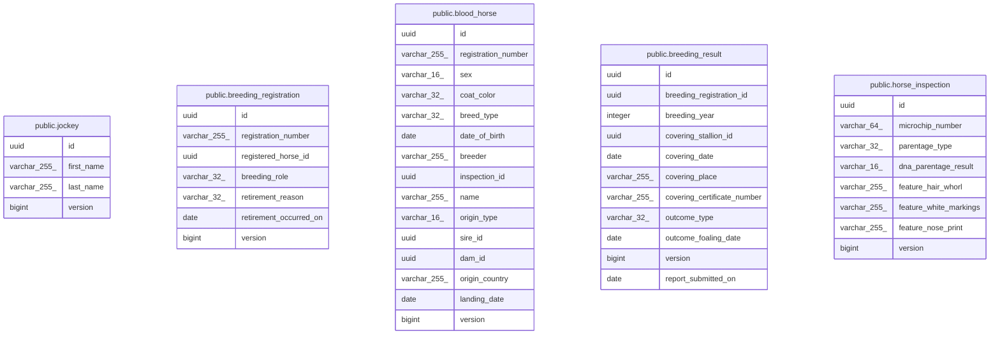

# toy-box DB schema

## Tables

| Name | Columns | Comment | Type |
| ---- | ------- | ------- | ---- |
| [public.jockey](public.jockey.md) | 4 | 騎手（JRA 競馬コンテキスト） | BASE TABLE |
| [public.breeding_registration](public.breeding_registration.md) | 7 | 繁殖登録（軽種馬登録コンテキスト） | BASE TABLE |
| [public.blood_horse](public.blood_horse.md) | 15 | 血統馬（軽種馬登録コンテキスト） | BASE TABLE |
| [public.breeding_result](public.breeding_result.md) | 11 | 繁殖成績（軽種馬登録コンテキスト） | BASE TABLE |
| [public.horse_inspection](public.horse_inspection.md) | 8 | 個体識別審査・親子判定（軽種馬登録コンテキスト） | BASE TABLE |

## Relations

---

> Generated by [tbls](https://github.com/k1LoW/tbls)
