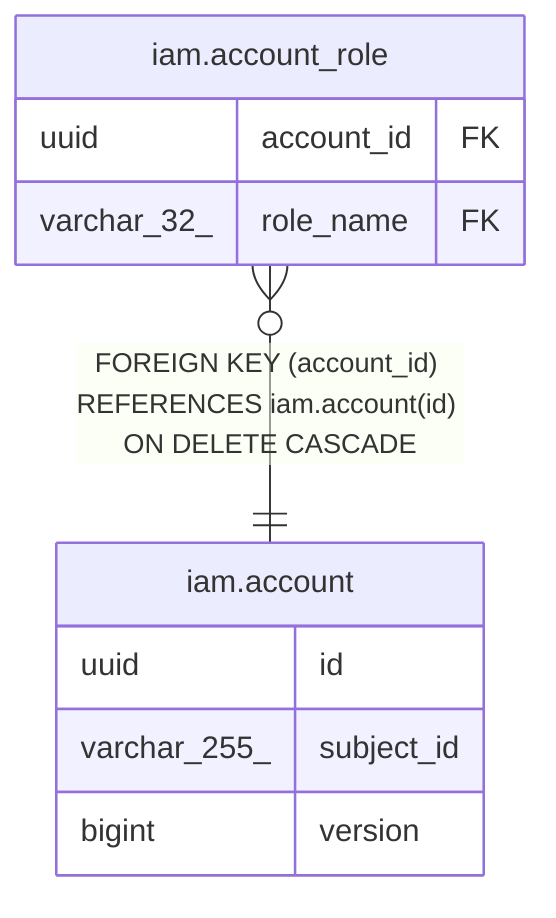

# iam.account

## Description

この API の利用者アカウント（IdP の subject に役割を結びつける）

## Columns

| Name | Type | Default | Nullable | Children | Parents | Comment |
| ---- | ---- | ------- | -------- | -------- | ------- | ------- |
| id | uuid |  | false | [iam.account_role](iam.account_role.md) |  | アカウントID（外部採番の UUIDv7） |
| subject_id | varchar(255) |  | false |  |  | IdP（Identity Platform）が発行する ID トークンの sub |
| version | bigint |  | false |  |  | 楽観ロック兼 insert 判定用の version |

## Constraints

| Name | Type | Definition |
| ---- | ---- | ---------- |
| account_pkey | PRIMARY KEY | PRIMARY KEY (id) |
| uq_account_subject_id | UNIQUE | UNIQUE (subject_id) |

## Indexes

| Name | Definition |
| ---- | ---------- |
| account_pkey | CREATE UNIQUE INDEX account_pkey ON iam.account USING btree (id) |
| uq_account_subject_id | CREATE UNIQUE INDEX uq_account_subject_id ON iam.account USING btree (subject_id) |

## Relations

---

> Generated by [tbls](https://github.com/k1LoW/tbls)
