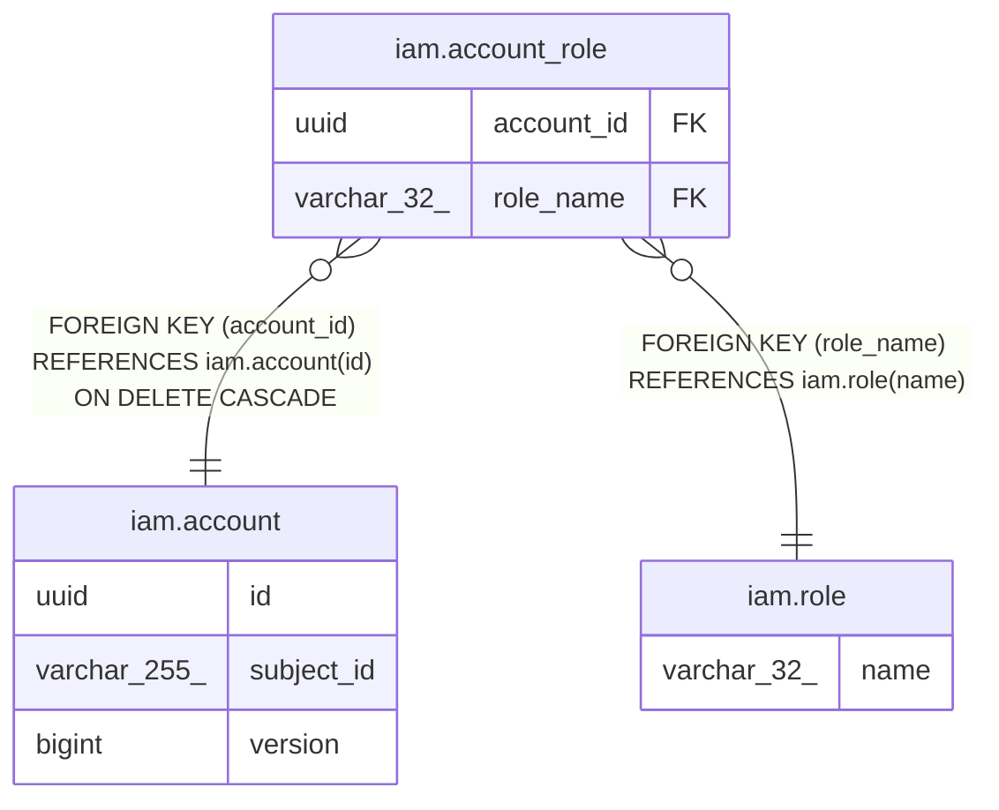

# iam.account_role

## Description

アカウントに与えた役割（多対多）

## Columns

| Name | Type | Default | Nullable | Children | Parents | Comment |
| ---- | ---- | ------- | -------- | -------- | ------- | ------- |
| account_id | uuid |  | false |  | [iam.account](iam.account.md) | 役割を与えたアカウントのID |
| role_name | varchar(32) |  | false |  | [iam.role](iam.role.md) | 与えた役割名（iam.role への参照） |

## Constraints

| Name | Type | Definition |
| ---- | ---- | ---------- |
| fk_account_role_role | FOREIGN KEY | FOREIGN KEY (role_name) REFERENCES iam.role(name) |
| fk_account_role_account | FOREIGN KEY | FOREIGN KEY (account_id) REFERENCES iam.account(id) ON DELETE CASCADE |
| pk_account_role | PRIMARY KEY | PRIMARY KEY (account_id, role_name) |

## Indexes

| Name | Definition |
| ---- | ---------- |
| pk_account_role | CREATE UNIQUE INDEX pk_account_role ON iam.account_role USING btree (account_id, role_name) |

## Relations

---

> Generated by [tbls](https://github.com/k1LoW/tbls)
