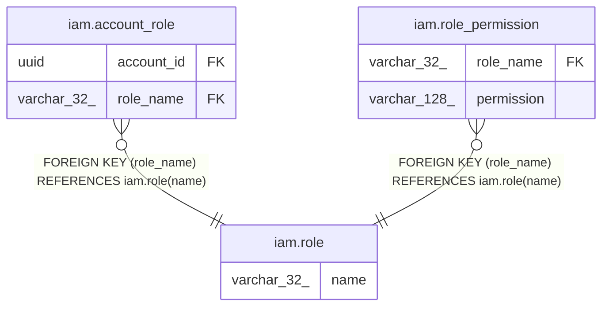

# iam.role

## Description

役割のマスタ（制度上の立場に対応する）

## Columns

| Name | Type | Default | Nullable | Children | Parents | Comment |
| ---- | ---- | ------- | -------- | -------- | ------- | ------- |
| name | varchar(32) |  | false | [iam.account_role](iam.account_role.md) [iam.role_permission](iam.role_permission.md) |  | 役割名（REGISTRAR=登録機関職員 / BREEDER=生産者・種牡馬所有者 / VIEWER=読み取りのみ） |

## Constraints

| Name | Type | Definition |
| ---- | ---- | ---------- |
| role_pkey | PRIMARY KEY | PRIMARY KEY (name) |

## Indexes

| Name | Definition |
| ---- | ---------- |
| role_pkey | CREATE UNIQUE INDEX role_pkey ON iam.role USING btree (name) |

## Relations

---

> Generated by [tbls](https://github.com/k1LoW/tbls)
