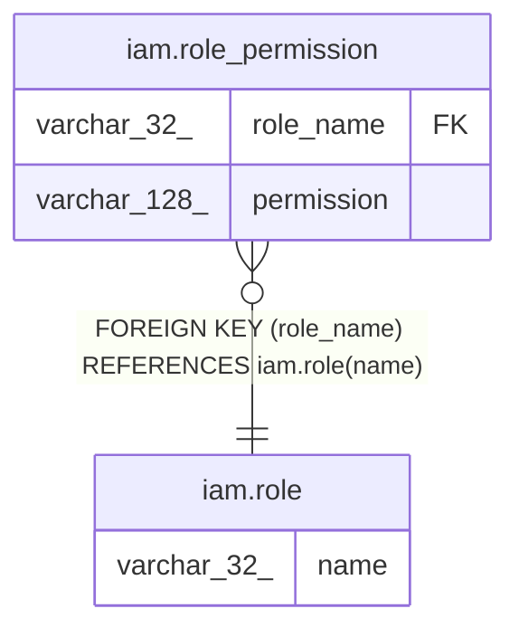

# iam.role_permission

## Description

役割に紐づく権限（権限定義そのもの。アプリの Permission 定数と文字列で一致する契約）

## Columns

| Name | Type | Default | Nullable | Children | Parents | Comment |
| ---- | ---- | ------- | -------- | -------- | ------- | ------- |
| role_name | varchar(32) |  | false |  | [iam.role](iam.role.md) | 権限を持つ役割名（iam.role への参照） |
| permission | varchar(128) |  | false |  |  | 権限（\<context\>:\<resource\>:\<action\>。StudbookPermissions / RacingPermissions と一致） |

## Constraints

| Name | Type | Definition |
| ---- | ---- | ---------- |
| fk_role_permission_role | FOREIGN KEY | FOREIGN KEY (role_name) REFERENCES iam.role(name) |
| pk_role_permission | PRIMARY KEY | PRIMARY KEY (role_name, permission) |

## Indexes

| Name | Definition |
| ---- | ---------- |
| pk_role_permission | CREATE UNIQUE INDEX pk_role_permission ON iam.role_permission USING btree (role_name, permission) |

## Relations

---

> Generated by [tbls](https://github.com/k1LoW/tbls)
