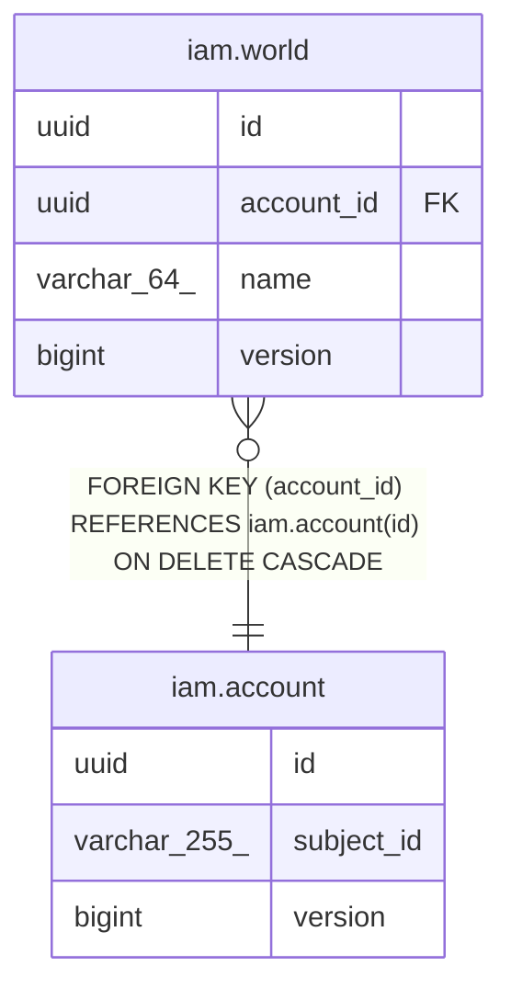

# iam.world

## Description

プレイヤーごとの世界（セーブデータ）。全ドメインのデータはいずれかの世界に属する

## Columns

| Name | Type | Default | Nullable | Children | Parents | Comment |
| ---- | ---- | ------- | -------- | -------- | ------- | ------- |
| id | uuid |  | false |  |  | 世界ID（外部採番の UUIDv7） |
| account_id | uuid |  | false |  | [iam.account](iam.account.md) | 世界を所有するアカウントのID（削除時は配下の世界も消える） |
| name | varchar(64) |  | false |  |  | プレイヤーが付けた世界の名前（同一アカウント内で一意） |
| version | bigint |  | false |  |  | 楽観ロック兼 insert 判定用の version |

## Constraints

| Name | Type | Definition |
| ---- | ---- | ---------- |
| fk_world_account | FOREIGN KEY | FOREIGN KEY (account_id) REFERENCES iam.account(id) ON DELETE CASCADE |
| world_pkey | PRIMARY KEY | PRIMARY KEY (id) |
| uq_world_account_id_name | UNIQUE | UNIQUE (account_id, name) |

## Indexes

| Name | Definition |
| ---- | ---------- |
| world_pkey | CREATE UNIQUE INDEX world_pkey ON iam.world USING btree (id) |
| uq_world_account_id_name | CREATE UNIQUE INDEX uq_world_account_id_name ON iam.world USING btree (account_id, name) |

## Relations

---

> Generated by [tbls](https://github.com/k1LoW/tbls)
