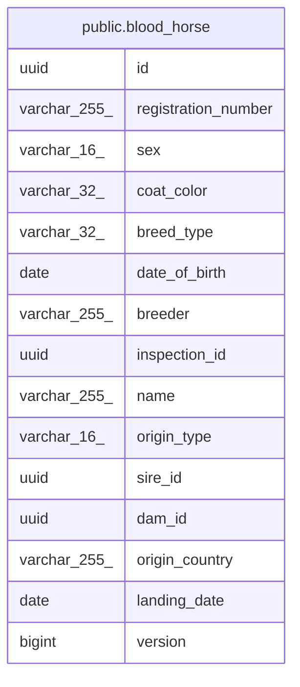

# public.blood_horse

## Description

血統馬（軽種馬登録コンテキスト）

## Columns

| Name | Type | Default | Nullable | Children | Parents | Comment |
| ---- | ---- | ------- | -------- | -------- | ------- | ------- |
| id | uuid |  | false |  |  | 識別子（外部採番の UUIDv7） |
| registration_number | varchar(255) |  | false |  |  | 登録番号 |
| sex | varchar(16) |  | false |  |  | 性別（ドメイン enum 名） |
| coat_color | varchar(32) |  | false |  |  | 毛色（ドメイン enum 名） |
| breed_type | varchar(32) |  | false |  |  | 品種区分（ドメイン enum 名） |
| date_of_birth | date |  | false |  |  | 生年月日 |
| breeder | varchar(255) |  | false |  |  | 生産者 |
| inspection_id | uuid |  | false |  |  | 個体識別審査（horse_inspection）の ID |
| name | varchar(255) |  | true |  |  | 馬名（未命名なら NULL） |
| origin_type | varchar(16) |  | false |  |  | 出自の判別子（DOMESTIC/IMPORTED） |
| sire_id | uuid |  | true |  |  | 父馬 ID（内国産のみ） |
| dam_id | uuid |  | true |  |  | 母馬 ID（内国産のみ） |
| origin_country | varchar(255) |  | true |  |  | 原産国（輸入のみ） |
| landing_date | date |  | true |  |  | 輸入上陸日（輸入のみ） |
| version | bigint |  | false |  |  | 楽観ロック用バージョン（新規判定の NULL はエンティティ側のみ。保存済み行は常に非 NULL） |

## Constraints

| Name | Type | Definition |
| ---- | ---- | ---------- |
| chk_blood_horse_origin | CHECK | CHECK (((((origin_type)::text = 'DOMESTIC'::text) AND (sire_id IS NOT NULL) AND (dam_id IS NOT NULL) AND (origin_country IS NULL) AND (landing_date IS NULL)) OR (((origin_type)::text = 'IMPORTED'::text) AND (origin_country IS NOT NULL) AND (landing_date IS NOT NULL) AND (sire_id IS NULL) AND (dam_id IS NULL)))) |
| blood_horse_pkey | PRIMARY KEY | PRIMARY KEY (id) |

## Indexes

| Name | Definition |
| ---- | ---------- |
| blood_horse_pkey | CREATE UNIQUE INDEX blood_horse_pkey ON public.blood_horse USING btree (id) |

## Relations

---

> Generated by [tbls](https://github.com/k1LoW/tbls)
