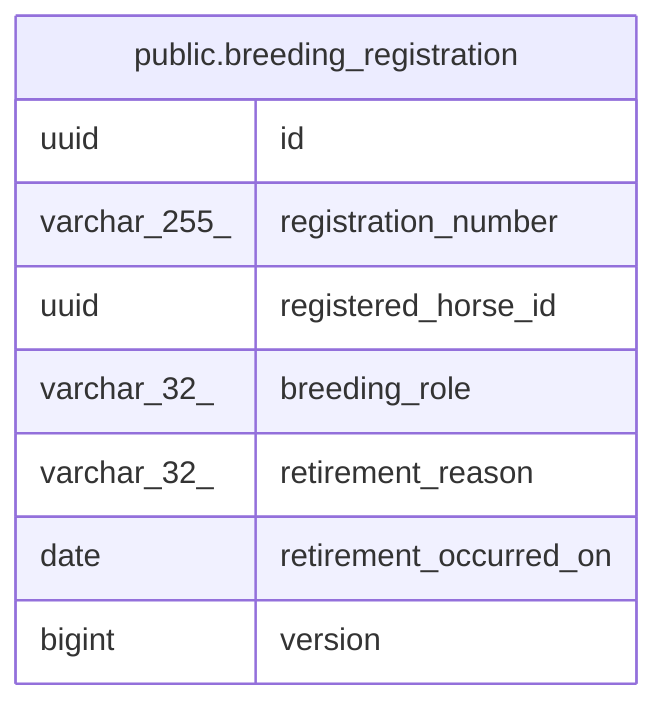

# public.breeding_registration

## Description

繁殖登録（軽種馬登録コンテキスト）

## Columns

| Name | Type | Default | Nullable | Children | Parents | Comment |
| ---- | ---- | ------- | -------- | -------- | ------- | ------- |
| id | uuid |  | false |  |  | 識別子（外部採番の UUIDv7） |
| registration_number | varchar(255) |  | false |  |  | 登録番号 |
| registered_horse_id | uuid |  | false |  |  | 登録対象の血統馬 ID |
| breeding_role | varchar(32) |  | false |  |  | 繁殖の役割（STALLION/BROODMARE） |
| retirement_reason | varchar(32) |  | true |  |  | 供用停止事由（供用中は NULL） |
| retirement_occurred_on | date |  | true |  |  | 供用停止発生日（供用中は NULL） |
| version | bigint |  | false |  |  | 楽観ロック用バージョン（新規判定の NULL はエンティティ側のみ。保存済み行は常に非 NULL） |

## Constraints

| Name | Type | Definition |
| ---- | ---- | ---------- |
| chk_breeding_registration_retirement_coexistence | CHECK | CHECK ((((retirement_reason IS NULL) AND (retirement_occurred_on IS NULL)) OR ((retirement_reason IS NOT NULL) AND (retirement_occurred_on IS NOT NULL)))) |
| breeding_registration_pkey | PRIMARY KEY | PRIMARY KEY (id) |

## Indexes

| Name | Definition |
| ---- | ---------- |
| breeding_registration_pkey | CREATE UNIQUE INDEX breeding_registration_pkey ON public.breeding_registration USING btree (id) |

## Relations

---

> Generated by [tbls](https://github.com/k1LoW/tbls)
