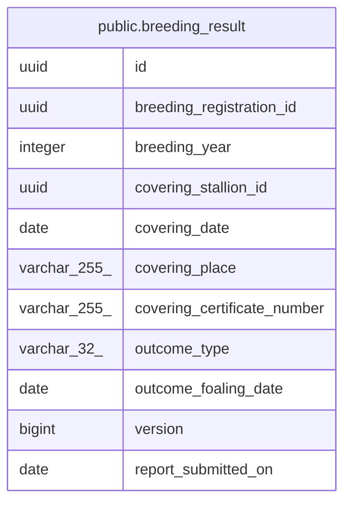

# public.breeding_result

## Description

繁殖成績（軽種馬登録コンテキスト）

## Columns

| Name | Type | Default | Nullable | Children | Parents | Comment |
| ---- | ---- | ------- | -------- | -------- | ------- | ------- |
| id | uuid |  | false |  |  | 識別子（外部採番の UUIDv7） |
| breeding_registration_id | uuid |  | false |  |  | 対象の繁殖登録 ID |
| breeding_year | integer |  | false |  |  | 繁殖年（java.time.Year の int 値） |
| covering_stallion_id | uuid |  | true |  |  | 種付種牡馬 ID（種付なしは NULL） |
| covering_date | date |  | true |  |  | 種付日（種付なしは NULL） |
| covering_place | varchar(255) |  | true |  |  | 種付場所（任意） |
| covering_certificate_number | varchar(255) |  | true |  |  | 種付証明書番号（種付なしは NULL） |
| outcome_type | varchar(32) |  | true |  |  | 分娩結果の判別子（NOT_COVERED/LIVE_FOAL 等） |
| outcome_foaling_date | date |  | true |  |  | 分娩日（生産 LIVE_FOAL のときのみ） |
| version | bigint |  | true |  |  | 楽観ロック兼新規 insert 判定（NULL のとき新規） |
| report_submitted_on | date |  | true |  |  | 繁殖成績報告書（様式第14号）の提出日（未提出は NULL） |

## Constraints

| Name | Type | Definition |
| ---- | ---- | ---------- |
| chk_breeding_result_covering | CHECK | CHECK ((((covering_stallion_id IS NULL) AND (covering_date IS NULL) AND (covering_certificate_number IS NULL) AND (covering_place IS NULL)) OR ((covering_stallion_id IS NOT NULL) AND (covering_date IS NOT NULL) AND (covering_certificate_number IS NOT NULL)))) |
| chk_breeding_result_foaling_date | CHECK | CHECK (((outcome_foaling_date IS NULL) OR ((outcome_type)::text = 'LIVE_FOAL'::text))) |
| chk_breeding_result_outcome_covering | CHECK | CHECK ((((covering_date IS NULL) AND ((outcome_type)::text = 'NOT_COVERED'::text)) OR ((covering_date IS NOT NULL) AND ((outcome_type IS NULL) OR ((outcome_type)::text <> 'NOT_COVERED'::text))))) |
| chk_breeding_result_report_needs_outcome | CHECK | CHECK (((report_submitted_on IS NULL) OR (outcome_type IS NOT NULL))) |
| breeding_result_pkey | PRIMARY KEY | PRIMARY KEY (id) |

## Indexes

| Name | Definition |
| ---- | ---------- |
| breeding_result_pkey | CREATE UNIQUE INDEX breeding_result_pkey ON public.breeding_result USING btree (id) |

## Relations

---

> Generated by [tbls](https://github.com/k1LoW/tbls)
