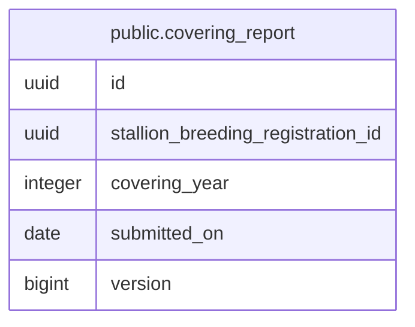

# public.covering_report

## Description

種付成績報告書（様式第13号）の年次提出記録（種牡馬×種付年）

## Columns

| Name | Type | Default | Nullable | Children | Parents | Comment |
| ---- | ---- | ------- | -------- | -------- | ------- | ------- |
| id | uuid |  | false |  |  | 種付成績報告ID（外部採番の UUIDv7） |
| stallion_breeding_registration_id | uuid |  | false |  |  | 提出した種牡馬の繁殖登録ID |
| covering_year | integer |  | false |  |  | 種付年（java.time.Year の int 値。報告対象年） |
| submitted_on | date |  | false |  |  | 提出日（日本の暦日）。期限（当年9/30）超過かは導出値のため保存しない |
| version | bigint |  | false |  |  | 楽観ロック兼 insert 判定用の version |

## Constraints

| Name | Type | Definition |
| ---- | ---- | ---------- |
| covering_report_pkey | PRIMARY KEY | PRIMARY KEY (id) |
| uq_covering_report_stallion_year | UNIQUE | UNIQUE (stallion_breeding_registration_id, covering_year) |

## Indexes

| Name | Definition |
| ---- | ---------- |
| covering_report_pkey | CREATE UNIQUE INDEX covering_report_pkey ON public.covering_report USING btree (id) |
| uq_covering_report_stallion_year | CREATE UNIQUE INDEX uq_covering_report_stallion_year ON public.covering_report USING btree (stallion_breeding_registration_id, covering_year) |

## Relations

---

> Generated by [tbls](https://github.com/k1LoW/tbls)
