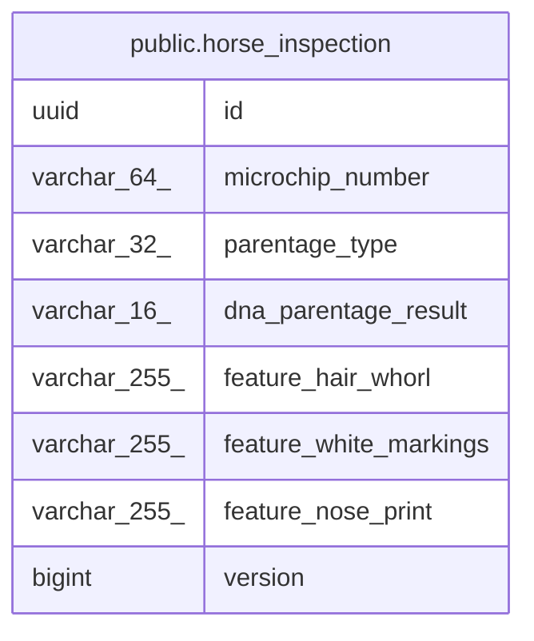

# public.horse_inspection

## Description

個体識別審査・親子判定（軽種馬登録コンテキスト）

## Columns

| Name | Type | Default | Nullable | Children | Parents | Comment |
| ---- | ---- | ------- | -------- | -------- | ------- | ------- |
| id | uuid |  | false |  |  | 識別子（外部採番の UUIDv7） |
| microchip_number | varchar(64) |  | false |  |  | マイクロチップ番号 |
| parentage_type | varchar(32) |  | false |  |  | 親子判定の判別子（BY_DNA/BY_BLOOD_TYPE/BY_OVERSEAS_INSTITUTION/NOT_APPLICABLE） |
| dna_parentage_result | varchar(16) |  | true |  |  | DNA 親子判定結果（BY_DNA のときのみ） |
| feature_hair_whorl | varchar(255) |  | true |  |  | 特徴記述子: 旋毛（未記録なら NULL） |
| feature_white_markings | varchar(255) |  | true |  |  | 特徴記述子: 白徴（未記録なら NULL） |
| feature_nose_print | varchar(255) |  | true |  |  | 特徴記述子: 鼻紋（未記録なら NULL） |
| version | bigint |  | true |  |  | 楽観ロック兼新規 insert 判定（NULL のとき新規） |

## Constraints

| Name | Type | Definition |
| ---- | ---- | ---------- |
| chk_horse_inspection_parentage | CHECK | CHECK (((((parentage_type)::text = 'BY_DNA'::text) AND (dna_parentage_result IS NOT NULL)) OR (((parentage_type)::text <> 'BY_DNA'::text) AND (dna_parentage_result IS NULL)))) |
| horse_inspection_pkey | PRIMARY KEY | PRIMARY KEY (id) |

## Indexes

| Name | Definition |
| ---- | ---------- |
| horse_inspection_pkey | CREATE UNIQUE INDEX horse_inspection_pkey ON public.horse_inspection USING btree (id) |

## Relations

---

> Generated by [tbls](https://github.com/k1LoW/tbls)
