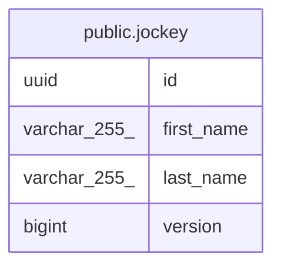

# public.jockey

## Description

騎手（JRA 競馬コンテキスト）

## Columns

| Name | Type | Default | Nullable | Children | Parents | Comment |
| ---- | ---- | ------- | -------- | -------- | ------- | ------- |
| id | uuid |  | false |  |  | 識別子（外部採番の UUIDv7） |
| first_name | varchar(255) |  | false |  |  | 名 |
| last_name | varchar(255) |  | false |  |  | 姓 |
| version | bigint |  | false |  |  | 楽観ロック用バージョン（新規判定の NULL はエンティティ側のみ。保存済み行は常に非 NULL） |

## Constraints

| Name | Type | Definition |
| ---- | ---- | ---------- |
| jockey_pkey | PRIMARY KEY | PRIMARY KEY (id) |

## Indexes

| Name | Definition |
| ---- | ---------- |
| jockey_pkey | CREATE UNIQUE INDEX jockey_pkey ON public.jockey USING btree (id) |

## Relations

---

> Generated by [tbls](https://github.com/k1LoW/tbls)
