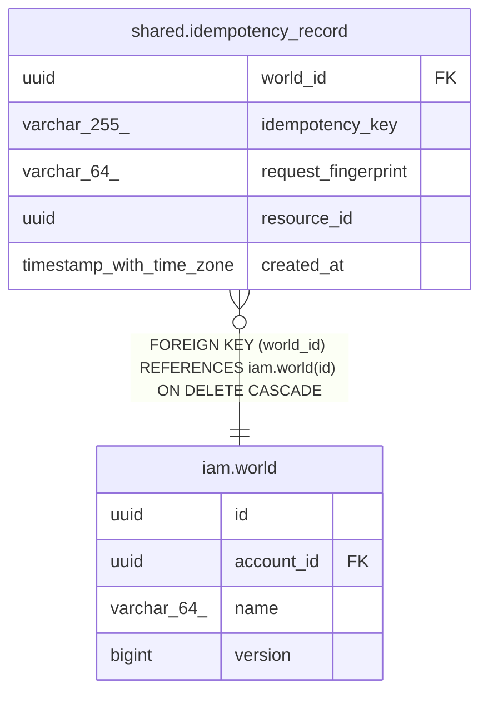

# shared.idempotency_record

## Description

再送を識別する冪等キーの記録（Idempotency-Key ヘッダ）

## Columns

| Name | Type | Default | Nullable | Children | Parents | Comment |
| ---- | ---- | ------- | -------- | -------- | ------- | ------- |
| world_id | uuid |  | false |  | [iam.world](iam.world.md) | キーが属する世界のID（世界の削除で連鎖削除される） |
| idempotency_key | varchar(255) |  | false |  |  | クライアントが付けた冪等キー |
| request_fingerprint | varchar(64) |  | false |  |  | リクエスト DTO の SHA-256（hex） |
| resource_id | uuid |  | true |  |  | 成功時に作られたリソースのID（未成功なら NULL） |
| created_at | timestamp with time zone |  | false |  |  | キーを確保した時刻 |

## Constraints

| Name | Type | Definition |
| ---- | ---- | ---------- |
| fk_idempotency_record_world | FOREIGN KEY | FOREIGN KEY (world_id) REFERENCES iam.world(id) ON DELETE CASCADE |
| pk_idempotency_record | PRIMARY KEY | PRIMARY KEY (world_id, idempotency_key) |

## Indexes

| Name | Definition |
| ---- | ---------- |
| pk_idempotency_record | CREATE UNIQUE INDEX pk_idempotency_record ON shared.idempotency_record USING btree (world_id, idempotency_key) |

## Triggers

| Name | Definition | Comment |
| ---- | ---------- | ------- |
| trg_idempotency_record_world_id_immutable | CREATE TRIGGER trg_idempotency_record_world_id_immutable BEFORE UPDATE ON shared.idempotency_record FOR EACH ROW WHEN ((old.world_id IS DISTINCT FROM new.world_id)) EXECUTE FUNCTION iam.reject_world_id_update() | world_id の書き換えを拒否する（行の世界間移動の禁止） |

## Relations

---

> Generated by [tbls](https://github.com/k1LoW/tbls)
