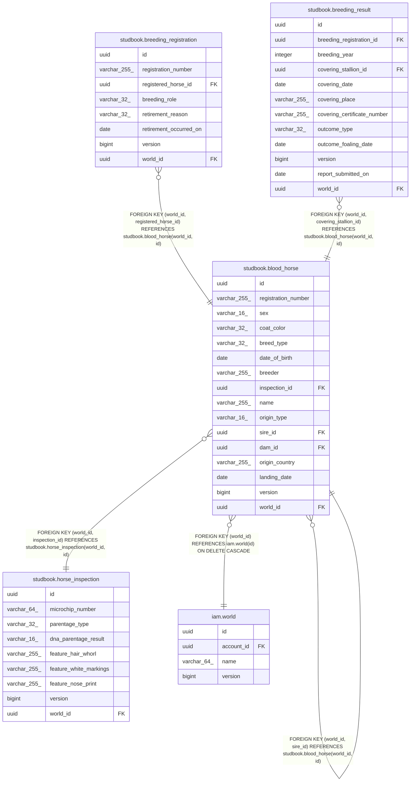

# studbook.blood_horse

## Description

血統馬（軽種馬登録コンテキスト）

## Columns

| Name | Type | Default | Nullable | Children | Parents | Comment |
| ---- | ---- | ------- | -------- | -------- | ------- | ------- |
| id | uuid |  | false | [studbook.breeding_registration](studbook.breeding_registration.md) [studbook.blood_horse](studbook.blood_horse.md) [studbook.breeding_result](studbook.breeding_result.md) |  | 識別子（外部採番の UUIDv7） |
| registration_number | varchar(255) |  | false |  |  | 登録番号 |
| sex | varchar(16) |  | false |  |  | 性別（ドメイン enum 名） |
| coat_color | varchar(32) |  | false |  |  | 毛色（ドメイン enum 名） |
| breed_type | varchar(32) |  | false |  |  | 品種区分（ドメイン enum 名） |
| date_of_birth | date |  | false |  |  | 生年月日 |
| breeder | varchar(255) |  | false |  |  | 生産者 |
| inspection_id | uuid |  | false |  | [studbook.horse_inspection](studbook.horse_inspection.md) | 個体識別審査（horse_inspection）の ID |
| name | varchar(255) |  | true |  |  | 馬名（未命名なら NULL） |
| origin_type | varchar(16) |  | false |  |  | 出自の判別子（DOMESTIC/IMPORTED/CARRIED_OVER） |
| sire_id | uuid |  | true |  | [studbook.blood_horse](studbook.blood_horse.md) | 父馬 ID（内国産のみ） |
| dam_id | uuid |  | true |  | [studbook.blood_horse](studbook.blood_horse.md) | 母馬 ID（内国産のみ） |
| origin_country | varchar(255) |  | true |  |  | 原産国（輸入のみ） |
| landing_date | date |  | true |  |  | 輸入上陸日（輸入のみ） |
| version | bigint |  | false |  |  | 楽観ロック用バージョン（新規判定の NULL はエンティティ側のみ。保存済み行は常に非 NULL） |
| world_id | uuid |  | false | [studbook.breeding_registration](studbook.breeding_registration.md) [studbook.blood_horse](studbook.blood_horse.md) [studbook.breeding_result](studbook.breeding_result.md) | [iam.world](iam.world.md) [studbook.blood_horse](studbook.blood_horse.md) [studbook.horse_inspection](studbook.horse_inspection.md) | この行が属する世界（セーブデータ）のID |

## Constraints

| Name | Type | Definition |
| ---- | ---- | ---------- |
| chk_blood_horse_origin | CHECK | CHECK (((((origin_type)::text = 'DOMESTIC'::text) AND (sire_id IS NOT NULL) AND (dam_id IS NOT NULL) AND (origin_country IS NULL) AND (landing_date IS NULL)) OR (((origin_type)::text = 'IMPORTED'::text) AND (origin_country IS NOT NULL) AND (landing_date IS NOT NULL) AND (sire_id IS NULL) AND (dam_id IS NULL)) OR (((origin_type)::text = 'CARRIED_OVER'::text) AND (sire_id IS NULL) AND (dam_id IS NULL) AND (origin_country IS NULL) AND (landing_date IS NULL)))) |
| blood_horse_pkey | PRIMARY KEY | PRIMARY KEY (id) |
| fk_blood_horse_world | FOREIGN KEY | FOREIGN KEY (world_id) REFERENCES iam.world(id) ON DELETE CASCADE |
| fk_blood_horse_dam | FOREIGN KEY | FOREIGN KEY (world_id, dam_id) REFERENCES studbook.blood_horse(world_id, id) |
| fk_blood_horse_sire | FOREIGN KEY | FOREIGN KEY (world_id, sire_id) REFERENCES studbook.blood_horse(world_id, id) |
| uq_blood_horse_world_id_id | UNIQUE | UNIQUE (world_id, id) |
| fk_blood_horse_inspection | FOREIGN KEY | FOREIGN KEY (world_id, inspection_id) REFERENCES studbook.horse_inspection(world_id, id) |
| uq_blood_horse_name | UNIQUE | UNIQUE (world_id, name) |
| uq_blood_horse_registration_number | UNIQUE | UNIQUE (world_id, registration_number) |

## Indexes

| Name | Definition |
| ---- | ---------- |
| blood_horse_pkey | CREATE UNIQUE INDEX blood_horse_pkey ON studbook.blood_horse USING btree (id) |
| uq_blood_horse_world_id_id | CREATE UNIQUE INDEX uq_blood_horse_world_id_id ON studbook.blood_horse USING btree (world_id, id) |
| ix_blood_horse_inspection_id | CREATE INDEX ix_blood_horse_inspection_id ON studbook.blood_horse USING btree (world_id, inspection_id) |
| ix_blood_horse_sire_id | CREATE INDEX ix_blood_horse_sire_id ON studbook.blood_horse USING btree (world_id, sire_id) |
| ix_blood_horse_dam_id | CREATE INDEX ix_blood_horse_dam_id ON studbook.blood_horse USING btree (world_id, dam_id) |
| uq_blood_horse_name | CREATE UNIQUE INDEX uq_blood_horse_name ON studbook.blood_horse USING btree (world_id, name) |
| uq_blood_horse_registration_number | CREATE UNIQUE INDEX uq_blood_horse_registration_number ON studbook.blood_horse USING btree (world_id, registration_number) |

## Relations

---

> Generated by [tbls](https://github.com/k1LoW/tbls)
