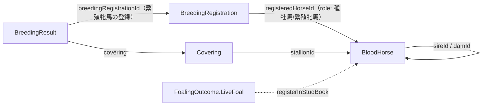

# ユビキタス言語

ドメインで用いる用語を、境界づけられたコンテキスト（`horseracing` / `sakamichi` / `tennis`）ごとに一覧化する。
同じ単語でもコンテキストや文脈で意味がずれる点を明示し、コードのリネームと用語の乖離を防ぐことを目的とする。

この文書は **2 層構成** で陳腐化を防ぐ（issue #346）:

1. **用語集（手書き）** — 定義・和名・別名・禁止語など、コードには現れない知識を人が書く。
2. **型レベル用語カタログ（自動生成）** — jMolecules のビルディングブロック（`@AggregateRoot` /
   `@Entity` / `@ValueObject` / `@Repository`）とドメインサービス（`service/` のトップレベル関数）を
   バイトコードから走査して生成する。**コードが唯一の出所**であり、`UbiquitousLanguageCatalogTest` が
   コミット済みの内容と一致することを検証する。

> **メンテナンス方法**: ビルディングブロックを追加・改名・削除すると `UbiquitousLanguageCatalogTest` が
> 落ちる。次でカタログを再生成し、併せて下の手書き用語集にも定義を足してからコミットする。
>
> ```bash
> ./gradlew test --tests "*UbiquitousLanguageCatalogTest" -DubiquitousLanguage.update=true
> ```

---

## 用語集（手書き）

凡例 — **種別**: 集約ルート / エンティティ / 値オブジェクト / リポジトリポート / ドメインサービス。
**禁止語**は「使うと誤解を生むため避ける言い回し」を表す。

### horseracing コンテキスト（競馬）

軽種馬（サラブレッド等）の JAIRS 管掌の登録（血統登録・馬名登録・繁殖登録）を扱う。中核は「血統登録の成立で
軽種馬が誕生し、同一個体が繁殖登録で繁殖ロール（繁殖牝馬・種牡馬）を担う」という捉え方。競走馬（Racehorse）は
JRA 管掌で別コンテキスト（[ADR-0013](adr/0013-racehorse-registration-as-separate-context.md)、当面スコープ外）。

#### 馬・個体（horse / bloodhorse サブドメイン）

| 用語（英） | 和名 | 種別 | 定義 | 別名・禁止語 |
| --- | --- | --- | --- | --- |
| BloodHorse | 軽種馬 | 集約ルート | 血統及び個体識別を明らかにする血統登録の成立によって誕生する個体。ライフサイクル全体を通じて同一の `BloodHorse` が各ロールを担う。 | 禁止: 単に「Horse」と呼ぶと文脈で曖昧。父母・ロールも別個体として扱わない |
| HorseName | 馬名 | 値オブジェクト | 血統登録済みの個体に一度だけ付与できる名。出生時は未命名（`null`）。 | — |
| PedigreeRegistrationNumber | 血統登録番号 | 値オブジェクト | 血統登録の成立時に交付される番号。 | — |
| MicrochipNumber | マイクロチップ番号 | 値オブジェクト | 個体識別に用いるマイクロチップの番号。 | — |
| StudBookEntry | 血統登録申請（個体識別の束） | 値オブジェクト | 申請者が持ち込む仔馬自身の個体識別情報の束。父母は集約をまたぐためここには含めない。 | — |
| DnaParentageResult | DNA 型親子判定結果 | 値オブジェクト | 申告された父母との親子関係の DNA 型検査結果（`CONSISTENT` のときのみ血統登録可）。 | — |
| BreedType | 品種 | 値オブジェクト | サラブレッド等の品種。親仔の品種整合の検証に用いる。 | — |
| CoatColor | 毛色 | 値オブジェクト | 馬の毛色。 | — |
| DateOfBirth | 生年月日 | 値オブジェクト | 個体の生年月日。 | — |
| Breeder | 生産者 | 値オブジェクト | 個体を生産した者。 | — |
| FoalIdentity | 仔馬の個体識別 | 値オブジェクト | 産駒の個体識別情報。 | — |
| Sex | 性 | （enum） | 雄（`MALE`）/ 雌（`FEMALE`）。父=雄・母=雌の前提検証、および繁殖ロール（`BreedingRole`）の決定に用いる。 | jMolecules 非付与のためカタログには出ない |

#### 繁殖（breeding サブドメイン）

| 用語（英） | 和名 | 種別 | 定義 | 別名・禁止語 |
| --- | --- | --- | --- | --- |
| BreedingRegistration | 繁殖登録 | 集約ルート | 馬を繁殖に供するための登録（JAIRS）。**雄雌共通の単一の登録**で、繁殖登録証明書の `性` によって担うロール（種牡馬／繁殖牝馬）が決まる。 | 雄雌で別集約にしない（種牡馬も繁殖登録の対象） |
| BreedingRole | 繁殖ロール | （enum） | 繁殖登録で付与されるロール。雄=種牡馬（`STALLION`）／雌=繁殖牝馬（`BROODMARE`）。性から定まる。 | jMolecules 非付与のためカタログには出ない。Stallion/Broodmare は別個体でなくこのロール |
| BreedingResult | 繁殖成績 | 集約ルート | 種付年ごとの「種付〜分娩」の年次レコード。「繁殖成績報告書」（様式第14号）1 行に対応。 | — |
| Covering | 種付 | 値オブジェクト | 種牡馬を繁殖牝馬に交配したという事実。種牡馬は `BloodHorseId` 参照。 | — |
| CoveringCertificateNumber | 種付証明書番号 | 値オブジェクト | 種付の事実を証明する種付証明書の番号。 | — |
| FoalingOutcome | 分娩結果 | 値オブジェクト（sealed） | 種付した繁殖牝馬がその年に迎えた帰結。生産（`LiveFoal`）と産駒なし各区分の sealed 語彙。 | sealed 親型自体は jMolecules 非付与（カタログには variant のみ出る） |
| FoalingOutcome.LiveFoal | 生産（産駒あり） | 値オブジェクト | 分娩により生存産駒を得た帰結。血統登録（`BloodHorse.create`）の入力に接続する。 | — |
| BreedingRegistrationNumber | 繁殖登録番号 | 値オブジェクト | 繁殖登録に交付される番号。 | — |

> **ロール用語の注意**: `Stallion`（種牡馬）/ `Broodmare`（繁殖牝馬）は独立した馬ではなく、繁殖登録
> （`BreedingRegistration`）で同一 `BloodHorse` に付与される**ロール**（`BreedingRole`、性から決定）を指す。
> 新規個体として生成しないこと。一方 `Racehorse`（競走馬）は JRA 管掌の競走馬登録に根拠を持ち、JAIRS 中心の
> 本コンテキストとは**別の境界づけられたコンテキスト**として扱う（当面スコープ外。[ADR-0013](adr/0013-racehorse-registration-as-separate-context.md)）。

> **権威ソースの区別（JAIRS / JBBA / JRA）**: 同ドメインに紛らわしい団体が併存する。
> **JAIRS**（公益財団法人ジャパン・スタッドブック・インターナショナル）＝**登録機関**で、血統登録・繁殖登録・
> 馬名登録と各種証明書の発行を管掌する（本コンテキストがモデル化する `BreedingRegistration` 等はここ）。
> **JBBA**（公益社団法人日本軽種馬協会）＝**生産振興・種牡馬繋養団体**で、種馬場の運営・種付サービス（種付料／
> 種付予約）・研修・せり市場を担う（運用側であり登録機関ではない）。**JRA/NAR** ＝競走馬登録（出走資格）の管掌。
> 「種牡馬の繁殖登録」は JAIRS、JBBA の「種牡馬」は自協会で繋養・供用する商用的な意味で、別レイヤーである。

#### 騎手・競走（jockey / race サブドメイン）

| 用語（英） | 和名 | 種別 | 定義 | 別名・禁止語 |
| --- | --- | --- | --- | --- |
| Jockey | 騎手 | 集約ルート | 競走で騎乗する者。 | — |
| Race | 競走 | 集約ルート | 競走（レース）。 | — |
| RaceResult | 競走結果 | 値オブジェクト | 競走の確定結果。 | — |

#### ドメインサービス（複数集約をまたぐ操作）

集約をまたぐ前提条件のうち、協力集約を**引数で受け取れば構築時に自己検証できる**ものは集約の `create` ファクトリへ移した（[ADR-0014](adr/0014-self-validating-factory-over-confinement.md)）。したがって血統登録・繁殖登録・種付記録は**ドメインサービスではなくファクトリ**である:

- 血統登録 = `BloodHorse.create`（父=雄・母=雌・DNA 親子整合・品種整合を検証）／輸入馬は `BloodHorse.createImported`
- 繁殖登録 = `BreedingRegistration.create`（雄雌共通、性から `BreedingRole` を決定）
- 種付記録 = `BreedingResult.create`（繁殖牝馬×種牡馬の登録ロールを検証）

ドメインサービスとして残るのは、複数の集約・ファクトリを束ねるオーケストレーションのみ:

| 用語（関数） | 和名 | 定義 |
| --- | --- | --- |
| registerFoal | 生産産駒を登録する | 生産（`LiveFoal`）を起点に、父母を解決して `BloodHorse.create` へ接続する。 |
| confirmRaceResult | 競走結果を確定する | 競走の結果を確定する。 |

### sakamichi コンテキスト（エンターテイメント）

探索段階。`Member`（メンバー）/ `MemberId` のみ。用語の整備は今後。

### tennis コンテキスト（スポーツ）

探索段階。`Player`（選手）/ `PlayerId` のみ。用語の整備は今後。

---

## 集約と参照関係（horseracing）

集約間の参照は ID 値クラス経由（ArchUnit で強制）。主要な参照関係を図示する。



---

## 型レベル用語カタログ（自動生成）

> このセクションは `UbiquitousLanguageCatalogTest` が生成・検証する。**手で編集しない**。
> 再生成方法は冒頭の「メンテナンス方法」を参照。

<!-- BEGIN GENERATED:ubiquitous-language -->

### horseracing

| 用語 | 種別 | パッケージ |
| --- | --- | --- |
| BloodHorse | 集約ルート | domain.horseracing.model.horse.bloodhorse |
| BreedingRegistration | 集約ルート | domain.horseracing.model.breeding |
| BreedingResult | 集約ルート | domain.horseracing.model.breeding |
| Jockey | 集約ルート | domain.horseracing.model.jockey |
| Race | 集約ルート | domain.horseracing.model.race |
| BloodHorseId | 値オブジェクト | domain.horseracing.model.horse.bloodhorse |
| BreedType | 値オブジェクト | domain.horseracing.model.horse.bloodhorse |
| Breeder | 値オブジェクト | domain.horseracing.model.horse.bloodhorse |
| BreedingRegistrationId | 値オブジェクト | domain.horseracing.model.breeding |
| BreedingRegistrationNumber | 値オブジェクト | domain.horseracing.model.breeding |
| BreedingResultId | 値オブジェクト | domain.horseracing.model.breeding |
| CoatColor | 値オブジェクト | domain.horseracing.model.horse.bloodhorse |
| Covering | 値オブジェクト | domain.horseracing.model.breeding |
| CoveringCertificateNumber | 値オブジェクト | domain.horseracing.model.breeding |
| DateOfBirth | 値オブジェクト | domain.horseracing.model.horse.bloodhorse |
| DnaParentageResult | 値オブジェクト | domain.horseracing.model.horse.bloodhorse |
| FoalIdentity | 値オブジェクト | domain.horseracing.model.horse.bloodhorse |
| FoalingOutcome.Abortion | 値オブジェクト | domain.horseracing.model.breeding |
| FoalingOutcome.LiveFoal | 値オブジェクト | domain.horseracing.model.breeding |
| FoalingOutcome.NeonatalDeath | 値オブジェクト | domain.horseracing.model.breeding |
| FoalingOutcome.NotConceived | 値オブジェクト | domain.horseracing.model.breeding |
| FoalingOutcome.NotCovered | 値オブジェクト | domain.horseracing.model.breeding |
| FoalingOutcome.Stillbirth | 値オブジェクト | domain.horseracing.model.breeding |
| FoalingOutcome.TwinAbortion | 値オブジェクト | domain.horseracing.model.breeding |
| FoalingOutcome.TwinNeonatalDeath | 値オブジェクト | domain.horseracing.model.breeding |
| FoalingOutcome.TwinStillbirth | 値オブジェクト | domain.horseracing.model.breeding |
| HorseName | 値オブジェクト | domain.horseracing.model.horse.bloodhorse |
| ImportedHorseEntry | 値オブジェクト | domain.horseracing.model.horse.bloodhorse |
| JockeyId | 値オブジェクト | domain.horseracing.model.jockey |
| LandingDate | 値オブジェクト | domain.horseracing.model.horse.bloodhorse |
| MicrochipNumber | 値オブジェクト | domain.horseracing.model.horse.bloodhorse |
| Origin | 値オブジェクト | domain.horseracing.model.horse.bloodhorse |
| Origin.Domestic | 値オブジェクト | domain.horseracing.model.horse.bloodhorse |
| Origin.Imported | 値オブジェクト | domain.horseracing.model.horse.bloodhorse |
| OriginCountry | 値オブジェクト | domain.horseracing.model.horse.bloodhorse |
| PedigreeRegistrationNumber | 値オブジェクト | domain.horseracing.model.horse.bloodhorse |
| RaceId | 値オブジェクト | domain.horseracing.model.race |
| StudBookEntry | 値オブジェクト | domain.horseracing.model.horse.bloodhorse |
| BloodHorseRepository | リポジトリポート | domain.horseracing.model.horse.bloodhorse |
| BreedingRegistrationRepository | リポジトリポート | domain.horseracing.model.breeding |
| BreedingResultRepository | リポジトリポート | domain.horseracing.model.breeding |
| JockeyRepository | リポジトリポート | domain.horseracing.model.jockey |
| confirmRaceResult | ドメインサービス | domain.horseracing.service.race |
| recordCovering | ドメインサービス | domain.horseracing.service.breeding |
| registerFoal | ドメインサービス | domain.horseracing.service.horse |

### sakamichi

| 用語 | 種別 | パッケージ |
| --- | --- | --- |
| Member | 集約ルート | domain.sakamichi.model |
| MemberId | 値オブジェクト | domain.sakamichi.model |

### tennis

| 用語 | 種別 | パッケージ |
| --- | --- | --- |
| Player | 集約ルート | domain.tennis.model |
| PlayerId | 値オブジェクト | domain.tennis.model |

<!-- END GENERATED:ubiquitous-language -->
