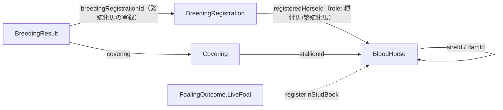

# ユビキタス言語

ドメインで用いる用語を、境界づけられたコンテキスト（`studbook` / `racing` / `sakamichi` / `tennis`）ごとに一覧化する。
同じ単語でもコンテキストや文脈で意味がずれる点を明示し、コードのリネームと用語の乖離を防ぐことを目的とする。

この文書は **2 層構成** で陳腐化を防ぐ（issue #346）:

1. **用語集（手書き）** — 定義・和名・別名・禁止語など、コードには現れない知識を人が書く。
2. **型レベル用語カタログ（自動生成）** — jMolecules のビルディングブロック（`@AggregateRoot` /
   `@Entity` / `@ValueObject` / `@Repository` / `@DomainEvent`）とドメインサービス（`service/` の
   トップレベル関数）を バイトコードから走査して生成する。**コードが唯一の出所**であり、
   `UbiquitousLanguageCatalogTest` が コミット済みの内容と一致することを検証する。

> **メンテナンス方法**: ビルディングブロックを追加・改名・削除すると `UbiquitousLanguageCatalogTest` が
> 落ちる。次でカタログを再生成し、併せて下の手書き用語集にも定義を足してからコミットする。
>
> ```bash
> ./gradlew test --tests "*UbiquitousLanguageCatalogTest" -DubiquitousLanguage.update=true
> ```

---

## 用語集（手書き）

凡例 — **種別**: 集約ルート / エンティティ / 値オブジェクト / リポジトリポート / ドメインイベント / ドメインサービス。
**禁止語**は「使うと誤解を生むため避ける言い回し」を表す。

### studbook コンテキスト（軽種馬登録）

軽種馬（サラブレッド等）の JAIRS 管掌の登録（血統登録・馬名登録・繁殖登録）を扱う。中核は「血統登録の成立で
軽種馬が誕生し、同一個体が繁殖登録で繁殖ロール（繁殖牝馬・種牡馬）を担う」という捉え方。騎手・競走（JRA 管掌）は
別コンテキスト `racing` へ分離した（[ADR-0024](adr/0024-split-studbook-and-racing-contexts.md)）。競走馬（Racehorse）の
登録自体も JRA 管掌で別コンテキスト（[ADR-0013](adr/0013-racehorse-registration-as-separate-context.md)、当面スコープ外）。

#### 馬・個体（horse / bloodhorse サブドメイン）

| 用語（英） | 和名 | 種別 | 定義 | 別名・禁止語 |
| --- | --- | --- | --- | --- |
| BloodHorse | 軽種馬 | 集約ルート | 血統及び個体識別を明らかにする血統登録の成立によって誕生する個体。ライフサイクル全体を通じて同一の `BloodHorse` が各ロールを担う。 | 禁止: 単に「Horse」と呼ぶと文脈で曖昧。父母・ロールも別個体として扱わない |
| HorseName | 馬名 | 値オブジェクト | 血統登録済みの個体に一度だけ付与できる名。出生時は未命名（`null`）。 | — |
| HorseNamed | 馬名登録された | ドメインイベント | 馬名登録（`BloodHorse.assignName`）の成功時に「起きたこと」を表すイベント。遷移後の集約とともに `StateTransition` で同梱して返し、発行は application 層が担う（[ADR-0029](adr/0029-domain-events-via-state-transition-return.md)）。 | 禁止: `Command`（何をしたいか）と混同しない。本型は結果（何が起きたか） |
| PedigreeRegistrationNumber | 血統登録番号 | 値オブジェクト | 血統登録の成立時に交付される番号。 | — |
| MicrochipNumber | マイクロチップ番号 | 値オブジェクト | 個体識別に用いるマイクロチップの番号。 | — |
| StudBookEntry | 血統登録申請（個体識別の束） | 値オブジェクト | 申請者が持ち込む仔馬自身の個体識別情報の束。父母は集約をまたぐためここには含めない。 | — |
| DnaParentageResult | DNA 型親子判定結果 | 値オブジェクト | 申告された父母との親子関係の DNA 型検査結果（`CONSISTENT` のときのみ血統登録可）。 | — |
| BreedType | 品種 | 値オブジェクト | サラブレッド等の品種。親仔の品種整合の検証に用いる。 | — |
| CoatColor | 毛色 | 値オブジェクト | 馬の毛色。 | — |
| DateOfBirth | 生年月日 | 値オブジェクト | 個体の生年月日。 | — |
| Breeder | 生産者 | 値オブジェクト | 個体を生産した者。 | — |
| FoalIdentity | 仔馬の個体識別 | 値オブジェクト | 産駒の個体識別情報。 | — |
| Sex | 性 | （enum） | 雄（`MALE`）/ 雌（`FEMALE`）。父=雄・母=雌の前提検証、および繁殖ロール（`BreedingRole`）の決定に用いる。 | jMolecules 非付与のためカタログには出ない |

#### 繁殖（breeding サブドメイン）

| 用語（英） | 和名 | 種別 | 定義 | 別名・禁止語 |
| --- | --- | --- | --- | --- |
| BreedingRegistration | 繁殖登録 | 集約ルート | 馬を繁殖に供するための登録（JAIRS）。**雄雌共通の単一の登録**で、繁殖登録証明書の `性` によって担うロール（種牡馬／繁殖牝馬）が決まる。 | 雄雌で別集約にしない（種牡馬も繁殖登録の対象） |
| BreedingRole | 繁殖ロール | （enum） | 繁殖登録で付与されるロール。雄=種牡馬（`STALLION`）／雌=繁殖牝馬（`BROODMARE`）。性から定まる。 | jMolecules 非付与のためカタログには出ない。Stallion/Broodmare は別個体でなくこのロール |
| BreedingResult | 繁殖成績 | 集約ルート | 種付年ごとの「種付〜分娩」の年次レコード。「繁殖成績報告書」（様式第14号）1 行に対応。年次提出（`submitReport`）の提出日と期限超過の導出を持つ。 | — |
| CoveringReport | 種付成績報告 | 集約ルート | 種付成績報告書（様式第13号）の年次提出記録（種牡馬×種付年）。提出行為が集約を生成する insert-only で、提出日と期限超過の導出（`submittedLate`）を持つ。報告の内容（明細・総括表）は `BreedingResult` から導出できるため保持しない。 | 種付 0 件の年の提出も受理する |
| BreedingReportDeadline | 繁殖成績報告の提出期限 | 値オブジェクト | 繁殖成績報告書（様式第14号）の提出期限＝繁殖年の翌年5/31（登録規程第25条）。期限超過の提出は拒否せず受理し、超過をドメインの事実として記録する（同条ただし書き）。 | 期限は日本の暦日（Asia/Tokyo）で締まる |
| CoveringReportDeadline | 種付成績報告の提出期限 | 値オブジェクト | 種付成績報告書（様式第13号）の提出期限＝種付年の当年9/30（登録規程第25条(1)）。期限超過の提出は拒否せず受理し、超過をドメインの事実として記録する。 | 期限は日本の暦日（Asia/Tokyo）で締まる。牝側 `BreedingReportDeadline`（翌年5/31）と非対称 |
| Covering | 種付 | 値オブジェクト | 種牡馬を繁殖牝馬に交配したという事実。種牡馬は `BloodHorseId` 参照。種付日・種付場所（`coveringPlace`）を持つ。 | — |
| CoveringCertificateNumber | 種付証明書番号 | 値オブジェクト | 種付の**事実**を証明する種付証明書の番号。 | 禁止: 種畜証明書（`StudCertificate`）と混同しない。別書面 |
| StudCertificate | 種畜証明書 | 値オブジェクト | 種雄馬が繁殖に供されることを証する書面。有効区域（`validRegions`）と有効期間（`validPeriod`）を持ち、種付がその内側で行われたかを `authorizes` で検証する（第9条第1項(1)）。 | 禁止: 種付証明書（`CoveringCertificateNumber`）と混同しない |
| StudCertificateNumber | 種畜証明書番号 | 値オブジェクト | 種畜証明書の番号。 | — |
| ValidityPeriod | 有効期間 | 値オブジェクト | 種畜証明書の有効期間（起点・終点を含む暦日の閉区間）。`contains` で種付日が内側かを判定。 | — |
| BreedingRegion | 区域（有効区域／種付場所） | 値オブジェクト | 種畜証明書の有効区域、および種付が行われた場所を表す名前付きの値。有効性は集合メンバーシップで判定（区域の包含関係はモデル対象外）。 | — |
| CoveringValidityError | 種付有効性違反 | 値オブジェクト（sealed） | 種付が種畜証明書の有効区域外（`OutsideValidRegion`）／有効期間外（`OutsideValidPeriod`）であることを表す。 | sealed 親型は jMolecules 非付与のためカタログには出ない |
| FoalingOutcome | 分娩結果 | 値オブジェクト（sealed） | 種付した繁殖牝馬がその年に迎えた帰結。生産（`LiveFoal`）と産駒なし各区分の sealed 語彙。 | sealed 親型自体は jMolecules 非付与（カタログには variant のみ出る） |
| FoalingOutcome.LiveFoal | 生産（産駒あり） | 値オブジェクト | 分娩により生存産駒を得た帰結。血統登録（`BloodHorse.create`）の入力に接続する。 | — |
| BreedingRegistrationNumber | 繁殖登録番号 | 値オブジェクト | 繁殖登録に交付される番号。 | — |
| BreedingResultSummaryView | 繁殖成績年次集計 | 読み取りモデル（@QueryModel） | (種牡馬, 種付年) 単位の繁殖成績。様式第2号（繁殖登録原簿〈雄〉）に対応。種付雌馬数・受胎数・生産数・受胎率・生産率を持つ。 | 軽量 CQRS（L2）の読みモデルのため application 層に置く |
| 種付雌馬数 | 種付雌馬数 | 集計値 | その種牡馬がその年に種付けした雌馬数（`covering` を持つ年次成績の件数）。 | — |
| 受胎数／受胎率 | 受胎数／受胎率 | 集計値 | 種付雌馬数のうち受胎が確認された件数（不受胎を除く。流産・死産・生後直死は受胎に含む）／その種付雌馬数比。 | — |
| 生産数／生産率 | 生産数／生産率 | 集計値 | 生存産駒を得た件数（`LiveFoal` のみ。生後直死は様式第14号裏「産駒がない母」に分類され含めない）／その種付雌馬数比。 | 禁止: 生後直死を生産に数えない |

> **ロール用語の注意**: `Stallion`（種牡馬）/ `Broodmare`（繁殖牝馬）は独立した馬ではなく、繁殖登録
> （`BreedingRegistration`）で同一 `BloodHorse` に付与される**ロール**（`BreedingRole`、性から決定）を指す。
> 新規個体として生成しないこと。一方 `Racehorse`（競走馬）は JRA 管掌の競走馬登録に根拠を持ち、JAIRS 中心の
> 本コンテキストとは**別の境界づけられたコンテキスト**として扱う（当面スコープ外。[ADR-0013](adr/0013-racehorse-registration-as-separate-context.md)）。

> **権威ソースの区別（JAIRS / JBBA / JRA）**: 同ドメインに紛らわしい団体が併存する。
> **JAIRS**（公益財団法人ジャパン・スタッドブック・インターナショナル）＝**登録機関**で、血統登録・繁殖登録・
> 馬名登録と各種証明書の発行を管掌する（本コンテキストがモデル化する `BreedingRegistration` 等はここ）。
> **JBBA**（公益社団法人日本軽種馬協会）＝**生産振興・種牡馬繋養団体**で、種馬場の運営・種付サービス（種付料／
> 種付予約）・研修・せり市場を担う（運用側であり登録機関ではない）。**JRA/NAR** ＝競走馬登録（出走資格）の管掌。
> 「種牡馬の繁殖登録」は JAIRS、JBBA の「種牡馬」は自協会で繋養・供用する商用的な意味で、別レイヤーである。

#### ドメインサービス（複数集約をまたぐ操作）

集約をまたぐ前提条件のうち、協力集約を**引数で受け取れば構築時に自己検証できる**ものは集約の `create` ファクトリへ移した（[ADR-0014](adr/0014-self-validating-factory-over-confinement.md)）。したがって血統登録・繁殖登録・種付記録は**ドメインサービスではなくファクトリ**である:

- 血統登録 = `BloodHorse.create`（父=雄・母=雌・DNA 親子整合・品種整合を検証）／輸入馬は `BloodHorse.createImported`
- 繁殖登録 = `BreedingRegistration.create`（雄雌共通、性から `BreedingRole` を決定）
- 種付記録 = `BreedingResult.create`（繁殖牝馬×種牡馬の登録ロールを検証）

ドメインサービスとして残るのは、複数の集約・ファクトリを束ねるオーケストレーションのみ:

| 用語（関数） | 和名 | 定義 |
| --- | --- | --- |
| registerFoal | 生産産駒を登録する | 生産（`LiveFoal`）を起点に、父母を解決して `BloodHorse.create` へ接続する。 |

### racing コンテキスト（競馬・JRA）

JRA 管掌の騎手・競走を扱う。騎手免許は競馬法で JRA が管掌し、競走（レース）・成績も JAIRS の登録原簿とは無関係なため、
`studbook` から分離した（[ADR-0024](adr/0024-split-studbook-and-racing-contexts.md)）。現状は探索段階のスタブ。

#### 騎手・競走（jockey / race サブドメイン）

| 用語（英） | 和名 | 種別 | 定義 | 別名・禁止語 |
| --- | --- | --- | --- | --- |
| Jockey | 騎手 | 集約ルート | 競走で騎乗する者。 | — |
| Race | 競走 | 集約ルート | 競走（レース）。 | — |
| RaceResult | 競走結果 | 値オブジェクト | 競走の確定結果。 | — |

#### ドメインサービス（複数集約をまたぐ操作）

| 用語（関数） | 和名 | 定義 |
| --- | --- | --- |
| confirmRaceResult | 競走結果を確定する | 競走の結果を確定する。 |

### sakamichi コンテキスト（エンターテイメント）

坂道シリーズ（乃木坂46・櫻坂46・日向坂46）のグループとメンバーの在籍（加入・卒業・期生）、シングルごとの
選抜編成を扱う。権威ソースの所在と用語の詳細は `.claude/skills/sakamichi-sources/` を参照。

| 用語 | 定義 | 補足 |
| --- | --- | --- |
| グループ（`Group`） | 坂道シリーズのアイドルグループ | 改名（欅坂46→櫻坂46 等）の状態遷移は未モデル化。漢字「欅坂46」とひらがな「けやき坂46」は**別グループ** |
| メンバー（`Member`） | グループに加入した個人。生成＝加入 | 在籍（所属・期生・在籍状態）はメンバー側が持つ。「メンバーは常に 1 グループのみ所属」前提（兼任の歴史的事例と昇格判断は #364 参照） |
| 期生（`Generation`） | 加入時期で区切るコホート（1期生・2期生…） | 加入時に固定。**グループごとに独立採番**（横断で一意でない） |
| 加入 / 卒業 | メンバーの参加 ／ 離脱の状態遷移（`Member.graduate`） | 卒業日は加入日以降。契約解除等の非円満離脱は「卒業」と区別しうるが未モデル化 |
| 在籍状態（`Membership`） | 在籍中（`Active`）／卒業済み（`Graduated`）の相互排他 | sealed で型強制（ADR-0020 の流儀） |
| シングル（`Single`） | グループが発表する作品。全収録曲（`Tracklist`）と見出し曲（表題曲）・選抜・非選抜曲（`NonSenbatsuTrack`）0..\* を内包する集約ルート | 見出し曲は `headlineTrackNumber` で指す。発表元グループは `GroupId` の ID 参照。発表後の編成変更等の状態遷移は未モデル化 |
| 作品番号（`ReleaseNumber`） | n 枚目（1 以上の整数） | **グループごと、かつシングル/アルバムで独立採番**（別集約なので同番号でも衝突しない）。グループ内の重複禁止は集合制約のため未モデル化（必要時に ADR-0022 の流儀でドメインサービスへ） |
| 収録曲（`Track`） | 作品に収録された 1 曲＝トラック番号 × 曲名 | 見出し曲もトラックの一種。曲ごとのフォーメーションは未モデル化（見出し曲の編成のみ作品集約が持つ） |
| 曲名（`TrackTitle`） | 収録曲の曲名（非ブランク・100 文字以内） | 表題曲/リード曲/カップリング曲を区別しない共通 VO。旧 `SingleTitle` / `AlbumTitle` を統合 |
| トラック番号（`TrackNumber`） | 作品内の収録曲の通し番号（1 以上） | 作品内で 1..n の連番・重複なしは `Tracklist.create` が検証 |
| 収録曲一覧（`Tracklist`） | 作品の全収録曲を通し番号で保持する VO | 不変条件: 空でない・番号が 1..n の連番・重複なし。曲名の重複は許容（別バージョン等の余地）。順序はトラック番号で定まる |
| アルバム（`Album`） | グループが発表する作品。全収録曲（`Tracklist`）と見出し曲（リード曲）・選抜・非選抜曲（`NonSenbatsuTrack`）0..\* を内包する集約ルート | 見出し曲は `headlineTrackNumber` で指す。発表元グループは `GroupId` の ID 参照。シングルとは独立採番 |
| 選抜（`Formation` の `senbatsu` ロール） | シングル表題曲/アルバムリード曲を歌う編成 | シングル・アルバム共通の作品編成語彙（`domain.sakamichi.model.release`）。**作品単位の一時的編成**（グループ・メンバーの恒久属性にしない）。不変条件: メンバー重複なし・`Center` 以外の立ち位置の定員 1 人・センター 1〜2 人（W センター許容） |
| 非選抜曲（`NonSenbatsuTrack`） | 作品内のトラック（`trackNumber`）× 編成（`formation`）の 1 曲（アンダー曲等）。`Single` / `Album` が 0..\* で内包（0 件＝全員選抜） | グループ別の呼称（乃木坂=アンダー / 櫻坂=BACKS / 日向坂=ひなた坂46）は `Group.nonSenbatsuAppellation`（`非選抜活動体の呼称`）としてモデル化済み（#582）。曲ごとに独自のセンター（アンダーセンター等）を持つ。トラックリスト内・見出し曲以外・重複なしは集約ファクトリ（`Single.create` / `Album.create`）が検証。排他（選抜と同一メンバー不可・非選抜曲同士の重複は許容）は `releaseSingle` / `releaseAlbum` が検証（ADR-0061） |
| 非選抜活動体の呼称（`Group.nonSenbatsuAppellation`） | グループ別の非選抜編成の呼び名（乃木坂46=アンダー／櫻坂46=BACKS／日向坂46=ひなた坂46） | `Group` の**任意属性**（`domain.sakamichi.model.group`）。呼称を持たないグループ/時期は null。**時間軸を持たない**（いつから適用かは作品側の関心・#583）。作品・編成・ライブとの結び付けは持たない。典拠は `.claude/skills/sakamichi-sources`（参照日 2026-07-08） |
| 立ち位置（`Position`） | フォーメーション上の位置。センター（`Center`）とそれ以外（`Spot`＝列 × 列内番号）の相互排他 | 作品ごとに変わる（シングル表題曲・アルバムリード曲共通）。1 列目が最前列。センターは 1〜2 人（W センター）・`Center` 以外は定員 1 人。センターと `Spot` の空間的重なりは未検証（探索段階の割り切り） |
| 編成の枠（`FormationSlot`） | 立ち位置 × メンバーの割り当て 1 件 | メンバーは `MemberId` の ID 参照。選抜・非選抜共通、シングル/アルバム共通で使う値オブジェクト |

#### ドメインサービス（複数集約をまたぐ操作）

| 用語（関数） | 和名 | 定義 |
| --- | --- | --- |
| releaseSingle | シングルを発売する | 検証済みの `tracklist`（`Tracklist`）と見出し曲の `headlineTrackNumber` を受け取り、選抜を編成してシングルを成立させる入口。非選抜曲の編成入力（`nonSenbatsuTracks`＝トラック番号 to 立ち位置つきメンバーの並びの列）を任意で受け取り、選抜との排他（非選抜曲同士の重複は許容）・全編成の在籍を検証する。集約をまたぐ前提条件「選抜対象メンバーが当該グループに在籍中（`Active`・所属一致）であること」を検証してから `Formation.create` → `Single.create` へ橋渡しする（studbook の `registerFoal` 型）。トラック整合（トラックリスト内・見出し曲以外・重複なし）の検証自体は `Single.create` に委譲する（ADR-0061）。 |
| releaseAlbum | アルバムを発売する | 検証済みの `tracklist`（`Tracklist`）と見出し曲の `headlineTrackNumber` を受け取り、選抜（リード曲フォーメーション）を編成してアルバムを成立させる入口。非選抜曲の編成入力を任意で受け取り、選抜との排他・全編成の在籍を検証する（`releaseSingle` と対称）。集約をまたぐ前提条件「選抜対象メンバーが当該グループに在籍中（`Active`・所属一致）であること」を検証してから `Formation.create` → `Album.create` へ橋渡しする。トラック整合の検証自体は `Album.create` に委譲する（ADR-0061）。 |

**禁止語・注意**: 「選抜」をグループやメンバーの恒久属性として扱わない（作品単位（シングル/アルバム共通）の一時的編成。⇔ 非選抜（アンダー）＝トラック × 編成の非選抜曲（`NonSenbatsuTrack`）0..\* としてモデル化済み（#556 / #583・ADR-0061）。呼称は `Group.nonSenbatsuAppellation` としてモデル化済み（#582））。
「選抜対象メンバーが当該グループに在籍中であること」の検証は集約またぎのため `Formation` では守らない（`releaseSingle` / `releaseAlbum` が封じ込める）。
「桜坂46」は誤記（正しくは旧字の「櫻坂46」）。

### tennis コンテキスト（スポーツ）

探索段階。`Player`（選手）/ `PlayerId` のみ。用語の整備は今後。

---

## 集約と参照関係（studbook）

集約間の参照は ID 値クラス経由（ArchUnit で強制）。主要な参照関係を図示する。


```mermaid
graph LR
  BreedingRegistration -->|registeredHorseId（role: 種牡馬/繁殖牝馬）| BloodHorse
  BreedingResult -->|breedingRegistrationId（繁殖牝馬の登録）| BreedingRegistration
  Covering -->|stallionId| BloodHorse
  BreedingResult -->|covering| Covering
  BloodHorse -->|sireId / damId| BloodHorse
  LiveFoal["FoalingOutcome.LiveFoal"] -.->|registerInStudBook| BloodHorse
```

---

## 型レベル用語カタログ（自動生成）

> このセクションは `UbiquitousLanguageCatalogTest` が生成・検証する。**手で編集しない**。
> 再生成方法は冒頭の「メンテナンス方法」を参照。

<!-- BEGIN GENERATED:ubiquitous-language -->

### iam

| 用語 | 種別 | パッケージ |
| --- | --- | --- |
| Account | 集約ルート | domain.iam.model.account |
| SubjectId | 値オブジェクト | domain.iam.model.account |
| AccountRepository | リポジトリポート | domain.iam.model.account |

### racing

| 用語 | 種別 | パッケージ |
| --- | --- | --- |
| Jockey | 集約ルート | domain.racing.model.jockey |
| Race | 集約ルート | domain.racing.model.race |
| JockeyId | 値オブジェクト | domain.racing.model.jockey |
| RaceId | 値オブジェクト | domain.racing.model.race |
| JockeyRepository | リポジトリポート | domain.racing.model.jockey |
| confirmRaceResult | ドメインサービス | domain.racing.service.race |

### sakamichi

| 用語 | 種別 | パッケージ |
| --- | --- | --- |
| Album | 集約ルート | domain.sakamichi.model.album |
| Group | 集約ルート | domain.sakamichi.model.group |
| Member | 集約ルート | domain.sakamichi.model.member |
| Single | 集約ルート | domain.sakamichi.model.single |
| AlbumId | 値オブジェクト | domain.sakamichi.model.album |
| Formation | 値オブジェクト | domain.sakamichi.model.release |
| FormationSlot | 値オブジェクト | domain.sakamichi.model.release |
| Generation | 値オブジェクト | domain.sakamichi.model.member |
| GroupId | 値オブジェクト | domain.sakamichi.model.group |
| GroupName | 値オブジェクト | domain.sakamichi.model.group |
| MemberId | 値オブジェクト | domain.sakamichi.model.member |
| MemberName | 値オブジェクト | domain.sakamichi.model.member |
| Membership | 値オブジェクト | domain.sakamichi.model.member |
| Membership.Active | 値オブジェクト | domain.sakamichi.model.member |
| Membership.Graduated | 値オブジェクト | domain.sakamichi.model.member |
| NonSenbatsuAppellation | 値オブジェクト | domain.sakamichi.model.group |
| NonSenbatsuTrack | 値オブジェクト | domain.sakamichi.model.release |
| Position | 値オブジェクト | domain.sakamichi.model.release |
| Position.Center | 値オブジェクト | domain.sakamichi.model.release |
| Position.Spot | 値オブジェクト | domain.sakamichi.model.release |
| ReleaseNumber | 値オブジェクト | domain.sakamichi.model.release |
| SingleId | 値オブジェクト | domain.sakamichi.model.single |
| Track | 値オブジェクト | domain.sakamichi.model.release |
| TrackNumber | 値オブジェクト | domain.sakamichi.model.release |
| TrackTitle | 値オブジェクト | domain.sakamichi.model.release |
| Tracklist | 値オブジェクト | domain.sakamichi.model.release |
| releaseAlbum | ドメインサービス | domain.sakamichi.service.album |
| releaseSingle | ドメインサービス | domain.sakamichi.service.single |

### shared

| 用語 | 種別 | パッケージ |
| --- | --- | --- |
| AccountId | 値オブジェクト | domain.shared |
| Actor | 値オブジェクト | domain.shared |
| Permission | 値オブジェクト | domain.shared |

### studbook

| 用語 | 種別 | パッケージ |
| --- | --- | --- |
| BloodHorse | 集約ルート | domain.studbook.model.horse.bloodhorse |
| BreedingRegistration | 集約ルート | domain.studbook.model.breeding |
| BreedingResult | 集約ルート | domain.studbook.model.breeding |
| CoveringReport | 集約ルート | domain.studbook.model.breeding |
| HorseInspection | 集約ルート | domain.studbook.model.inspection |
| BloodHorseId | 値オブジェクト | domain.studbook.model.horse.bloodhorse |
| BreedType | 値オブジェクト | domain.studbook.model.horse.bloodhorse |
| Breeder | 値オブジェクト | domain.studbook.model.horse.bloodhorse |
| BreedingRegion | 値オブジェクト | domain.studbook.model.breeding |
| BreedingRegistrationId | 値オブジェクト | domain.studbook.model.breeding |
| BreedingRegistrationNumber | 値オブジェクト | domain.studbook.model.breeding |
| BreedingReportDeadline | 値オブジェクト | domain.studbook.model.breeding |
| BreedingResultId | 値オブジェクト | domain.studbook.model.breeding |
| BreedingRetirement | 値オブジェクト | domain.studbook.model.breeding |
| CoatColor | 値オブジェクト | domain.studbook.model.horse.bloodhorse |
| Covering | 値オブジェクト | domain.studbook.model.breeding |
| CoveringCertificateNumber | 値オブジェクト | domain.studbook.model.breeding |
| CoveringReportDeadline | 値オブジェクト | domain.studbook.model.breeding |
| CoveringReportId | 値オブジェクト | domain.studbook.model.breeding |
| DateOfBirth | 値オブジェクト | domain.studbook.model.horse.bloodhorse |
| DnaParentageResult | 値オブジェクト | domain.studbook.model.inspection |
| FoalIdentity | 値オブジェクト | domain.studbook.model.horse.bloodhorse |
| FoalingOutcome.Abortion | 値オブジェクト | domain.studbook.model.breeding |
| FoalingOutcome.LiveFoal | 値オブジェクト | domain.studbook.model.breeding |
| FoalingOutcome.NeonatalDeath | 値オブジェクト | domain.studbook.model.breeding |
| FoalingOutcome.NotConceived | 値オブジェクト | domain.studbook.model.breeding |
| FoalingOutcome.NotCovered | 値オブジェクト | domain.studbook.model.breeding |
| FoalingOutcome.Stillbirth | 値オブジェクト | domain.studbook.model.breeding |
| FoalingOutcome.TwinAbortion | 値オブジェクト | domain.studbook.model.breeding |
| FoalingOutcome.TwinNeonatalDeath | 値オブジェクト | domain.studbook.model.breeding |
| FoalingOutcome.TwinStillbirth | 値オブジェクト | domain.studbook.model.breeding |
| HorseInspectionId | 値オブジェクト | domain.studbook.model.inspection |
| HorseName | 値オブジェクト | domain.studbook.model.horse.bloodhorse |
| IdentificationFeatures | 値オブジェクト | domain.studbook.model.inspection |
| ImportedHorseEntry | 値オブジェクト | domain.studbook.model.horse.bloodhorse |
| LandingDate | 値オブジェクト | domain.studbook.model.horse.bloodhorse |
| MicrochipNumber | 値オブジェクト | domain.studbook.model.inspection |
| Origin | 値オブジェクト | domain.studbook.model.horse.bloodhorse |
| Origin.Domestic | 値オブジェクト | domain.studbook.model.horse.bloodhorse |
| Origin.Imported | 値オブジェクト | domain.studbook.model.horse.bloodhorse |
| OriginCountry | 値オブジェクト | domain.studbook.model.horse.bloodhorse |
| ParentageDetermination | 値オブジェクト | domain.studbook.model.inspection |
| ParentageDetermination.ByBloodType | 値オブジェクト | domain.studbook.model.inspection |
| ParentageDetermination.ByDna | 値オブジェクト | domain.studbook.model.inspection |
| ParentageDetermination.ByOverseasInstitution | 値オブジェクト | domain.studbook.model.inspection |
| ParentageDetermination.NotApplicable | 値オブジェクト | domain.studbook.model.inspection |
| PedigreeRegistrationNumber | 値オブジェクト | domain.studbook.model.horse.bloodhorse |
| StudBookEntry | 値オブジェクト | domain.studbook.model.horse.bloodhorse |
| StudCertificate | 値オブジェクト | domain.studbook.model.breeding |
| StudCertificateNumber | 値オブジェクト | domain.studbook.model.breeding |
| ValidityPeriod | 値オブジェクト | domain.studbook.model.breeding |
| BloodHorseRepository | リポジトリポート | domain.studbook.model.horse.bloodhorse |
| BreedingRegistrationRepository | リポジトリポート | domain.studbook.model.breeding |
| BreedingResultRepository | リポジトリポート | domain.studbook.model.breeding |
| CoveringReportRepository | リポジトリポート | domain.studbook.model.breeding |
| HorseInspectionRepository | リポジトリポート | domain.studbook.model.inspection |
| HorseNamed | ドメインイベント | domain.studbook.model.horse.bloodhorse |
| nameHorse | ドメインサービス | domain.studbook.service.horse |
| recordCovering | ドメインサービス | domain.studbook.service.breeding |
| recordUncovered | ドメインサービス | domain.studbook.service.breeding |
| registerFoal | ドメインサービス | domain.studbook.service.horse |
| submitCoveringReport | ドメインサービス | domain.studbook.service.breeding |

### tennis

| 用語 | 種別 | パッケージ |
| --- | --- | --- |
| Player | 集約ルート | domain.tennis.model |
| PlayerId | 値オブジェクト | domain.tennis.model |

<!-- END GENERATED:ubiquitous-language -->
